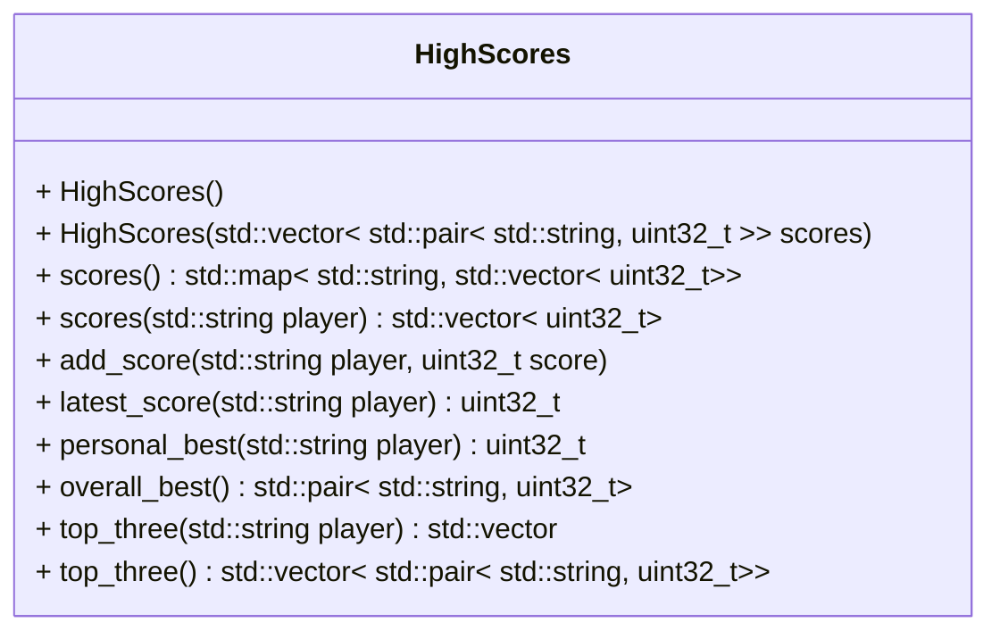

[](README.md)
[](README.de-at.md)


# High Scores für mehrere Spieler

Nach Abschluss der Aufgaben können die folgenden Befehle ausgeführt werden,
um die Richtigkeit der Lösung zu prüfen.

```shell
sudo apt install libcatch2-dev
mkdir build && cd build
cmake ..
make -j4
make test
```

Alternativ zu `make test` können die einzelnen `*_test` Programme ausgeführt
werden.


## Problembeschreibung

Es ist die High-Score-Liste eines Computerspielers für mehrere Spieler zu
verwalten.

Die Aufgabe besteht darin, eine High-Score-Komponente für Klassiker der
Arcade-Ära zu erstellen. Die Komponente soll in Spielen wie Frogger, Tetris
und anderen eingesetzt werden.

Es ist eine Klasse zu schreiben, die alle Punktezahlen aller Spieler
verwaltet und einige Abfragen erlaubt:

- letzter Spielstand eines Spielers
- alle Spielstände eines Spielers
- alle Spielstände aller Spieler
- persönlicher Highscore eines Spielers
- höchster jemals erzielter Spielstand
- die drei höchsten Spielstände eines Spielers in absteigender Reihenfolge
- die drei höchsten jemals erzielten Spielstände in absteigender Reihenfolge
Das untenstehende Klassendiagramm beschreibt die Klasse am Besten:



Die Klasse und alle ihre Methoden sind in `high_scores.hpp` und
`high_scores.cpp` zu implementieren.
