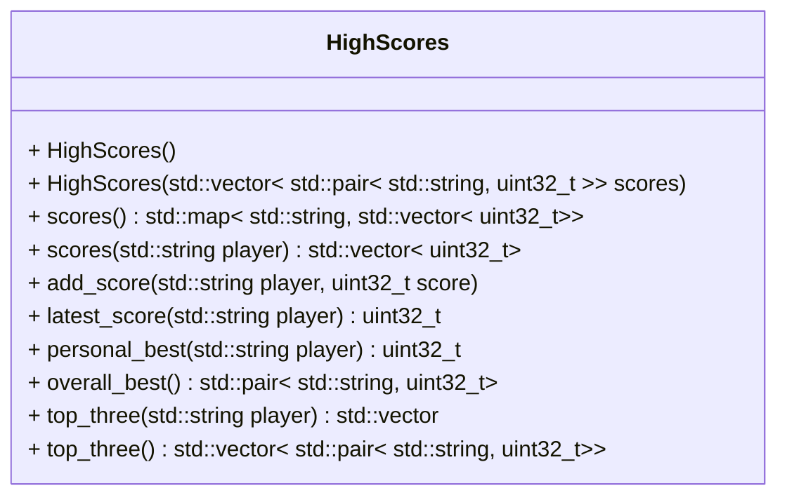

[](README.md)
[](README.de-at.md)

# Multiplayer High Scores

After finishing the below tasks, run the following commands to see if your code
is correct.

```shell
sudo apt install libcatch2-dev  # requires Debian 13 or newer
mkdir build && cd build
cmake ..
make -j4
make test
```

As an alternative to `make test` (or `ctest`) you can run the individual
`*_test` executables.


## Problem Description

Manage a game's high-score list for multiple players.

Your task is to build a high-score component for the classics of 
the arcade era. The component should be used in games like Frogger and Tetris.

Write a class that stores the scores for each player and
allows to perform some basic queries:

- the latest (most recent) score of a player
- all of a player's scores
- all scores of all players
- the personal high score of a given player
- the best (highest) score ever achieved
- the three highest scores of a given player, sorted descending
- the best (highest) three scores ever achieved, sorted descending

The class diagram below best describes the class:



Implement the class and all of its methods in `high_scores.hpp` and
`high_scores.cpp`.
