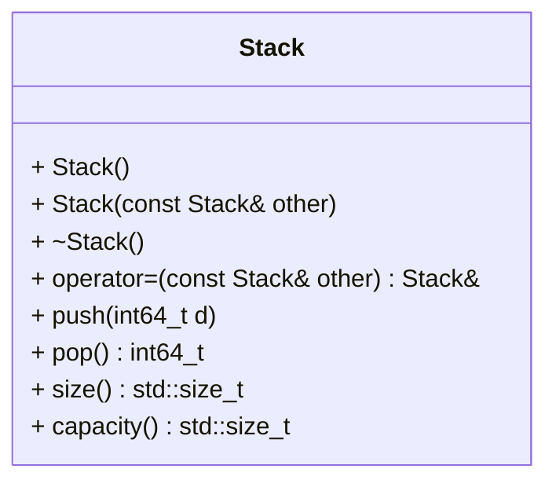

[](README.md)
[](README.de-at.md)

# Int Stack für ganze Zahlen (`int32_t`)

Nach Abschluss der Aufgaben können die folgenden Befehle ausgeführt werden,
um die Richtigkeit der Lösung zu prüfen.

```shell
mkdir build && cd build
cmake ..
make -j4
make test
```

Alternativ zu `make test` können die einzelnen `test_*` Programme ausgeführt
werden.


## Aufgabenstellung
Ihr Arbeitgeber beauftragt Sie Sensordaten eines Microcontrollers zu
verarbeiten. Alle Sensoren liefern ausschließlich `int64_t` Daten.

Es ist wichtig, alle Daten aller Sensoren zu verarbeiten. Allerdings werden
die Daten gelegentlich schneller übermittelt, als sie verarbeitet werden
können. In diesem Fall sind die jeweils aktuellsten Daten zuerst zu verwerten
und ältere Daten müssen zwischengespeichert werden, bis der Microcontroller
freie Kapazitäten hat.

Das Zwischenspeichern in solchen Fällen wird normalerweise mit einer
Datenstruktur namens `stack` erledigt. Ein `stack` ist ein abstrakter Datentyp.
Die Reihenfolge, mit der Elemente hinzugefügt oder entfernt werden heißt
last in, first out (LIFO). Das bedeutet, dass immer die zuletzt hinzugefügten
Elemente zuerst entfernt werden und steht im genauen Gegensatz zu einer
Warteschlange, bei der zuerst hinzugefügte Elemente auch zuerst bearbeitet
werden.

Bei diesem Projekt ist es leider nicht sichergestellt, dasss die C++
Standardbibliothek auf dem Microcontroller verfügbar ist. Daher dürfen nur
wenige Header für die Erstellung einer eigenen Datenstruktur verwendet werden:
`<cstddef>`, `<cstdint>` und `<iostream>`. Weiters darf auf
`<algorithm>` zurückgegriffen werden. Alle anderen Header (insbesondere die
Container der Standardbibliothek) dürfen nicht verwendet werden.

Ein großer Vorteil mit dem verwendeten Setup ist, dass stets hinreichend
viel Heap Speicher (Free Store) für alle gelieferten Sensordaten verfügbar
ist. Die aktuelle Aufgabe besteht darin, einen performanten Stack unter
Verwendung des Free Stores zu erstellen.

Die Softwarearchitektin im Team hat bereits das notwendige API in einem
Klassendiagramm beschrieben:



Die Wahl der zugrundeliegenden Datenstruktur ist frei, allerdings müssen alle 
Methoden amortisiert konstante Laufzeit ($O(1)$) haben.

`push(.)` füge ein Element hinten an den Stack  
`pop()` entferne das zuletzt hinzugefügte Element vom Stack  
`size()` gib die aktuelle Anzahl an Elements auf dem Stack zurück  
`capacity()` gib die aktuell verfügbare Kapazität zurück

Die initiale **capacity** (default constructor) muss 10 sein.
Wird die größe des Stacks kleiner oder gleich einem Viertel seiner Kapazität,
so ist die Kapazität auf die doppelte Anzahl der Elemente zu reduzieren.
Die Kapazität darf allerdings nie geringer als die initiale Kapazität werden.

Für die Implementierung sind die Dateinamen `stack.cpp` und `stack.hpp` zu
verwenden. In der Firma ist es üblich, dass für alle Datenstrukturen der
Namespace `ds` verwendet wird.
