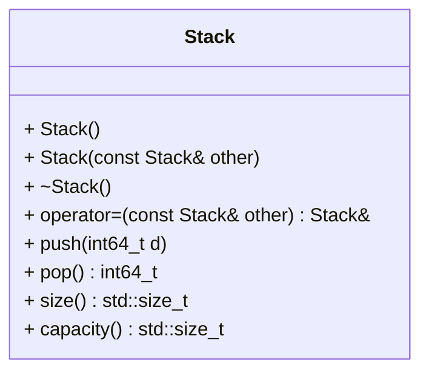

[](README.md)
[](README.de-at.md)

# Int Stack

After finishing the below tasks, run the following commands to see if your code
is correct.

```shell
mkdir build && cd build
cmake ..
make -j4
make test
```

As an alternative to `make test` (or `ctest`) you can run the individual
`*_test` executables.

## Task - Create a Stack for Storing Integers

Your employer gives you the task to read sensor data on an embedded system.
The sensors solely deliver data of type `int64_t`.

All sensor data has to be processed. However, it is crucial that the most
recent data is processed first and older data can simply be stored until
processing resources are available.

This can be ideally be done with a `stack`. A `stack` is an abstract data type.
The order in which elements are added to or removed from a stack is called as 
last in, first out (LIFO).

Your employer cannot ensure that the full C++ standard library stack will be
available on their embedded system of choice.
You may definitely use `<cstddef>` and `<cstdint>`. It is also ok to use
`<algorithm>` if desired, but no other headers (particularly no containers) are 
allowed.

On the plus side, your manager assures
that the embedded system will always have enough heap memory to store all
incoming data.
Now it is up to you to implement a well performing stack using dynamic memory.
The other programmers on your team have gathered requirements for the stack.
It must not rely on any standard library functionality and provide the
following public API:



It does not matter which underlying data structure you implement. However, all 
methods must have amortized constant ($O(1)$) runtime.

`push(.)` add an element to the stack  
`pop()` remove the most recently added element from the stack  
`size()` return the current number of elements  
`capacity()` return the currently available capacity

The initial **capacity** has to be 10.
If the size of the stack is smaller or equal than a fourth of its capacity, the 
capacity has to be reduced to twice the size. However, the capacity shall never
be reduced below its initial capacity.

Name your files `stack.cpp` and `stack.hpp` and place your code in the `ds`
namespace.
